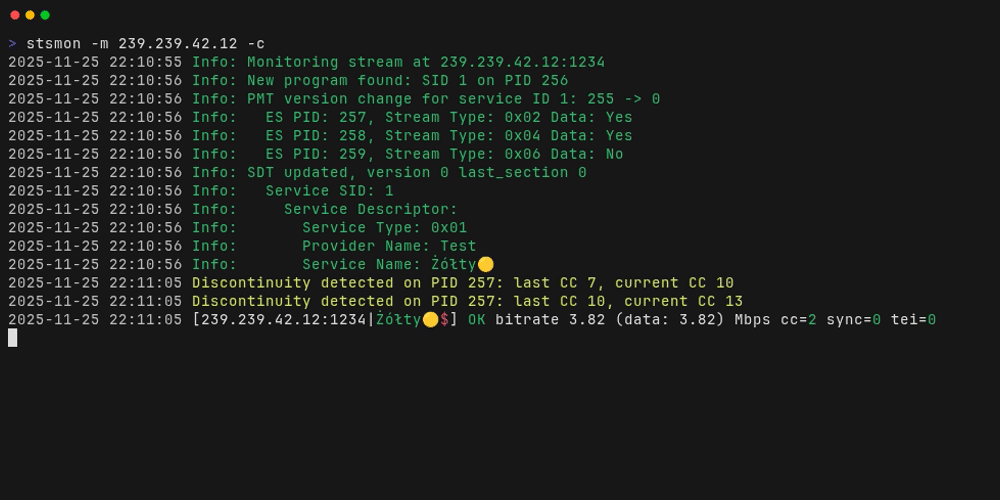

# stsmon - Simple Transport Stream Monitor

## Overview

`stsmon` is a lightweight command-line tool designed to basic monitoring of MPEG Transport Streams (TS).

## Features

- Basic monitoring of MPEG Transport Streams
- Can display real-time statistics for:
  - Bitrate
  - Continuity Counter (CC) errors
  - TEI errors
  - MPEG sync errors (packets without 0x47 sync byte)
  - Service names and PIDs
  - Packet arrival times
- Reads packets from UDP multicaast streams
- Logs statistics to a CSV file for further analysis
- Simple command-line interface
- Works on Linux and Windows, this should also work on potato with Linux and networking support


## Usage
Basic usage example:


For complete usage instruction consult [user manual](doc/stsmon.md)

## Installation

### Pre compiled binaries
Pre compiled binaries for Windows can be found on the [releases page](https://github.com/michal-pod/stsmon/releases)

### From source
To build `stsmon` from source, install CMake and a C++ compiler, then run the following commands:

```bash
git clone https://github.com/michal-pod/stsmon.git
cd stsmon
mkdir build
cd build
cmake ..
make
sudo make install
```

You can also cross compile for Windows on Linux using MinGW:

```bash
sudo apt-get install mingw-w64
mkdir build-windows
cd build-windows
cmake -DCMAKE_TOOLCHAIN_FILE=../cmake/mingw-x64.cmake .. # or mingw-x86.cmake for 32-bit
make
```